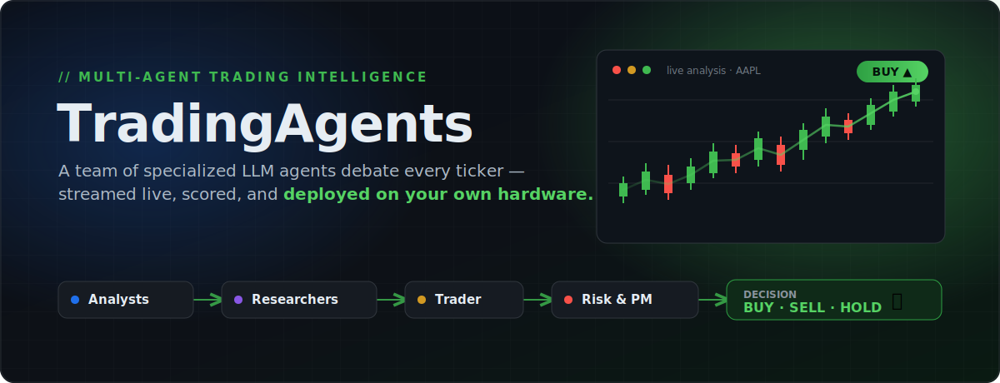
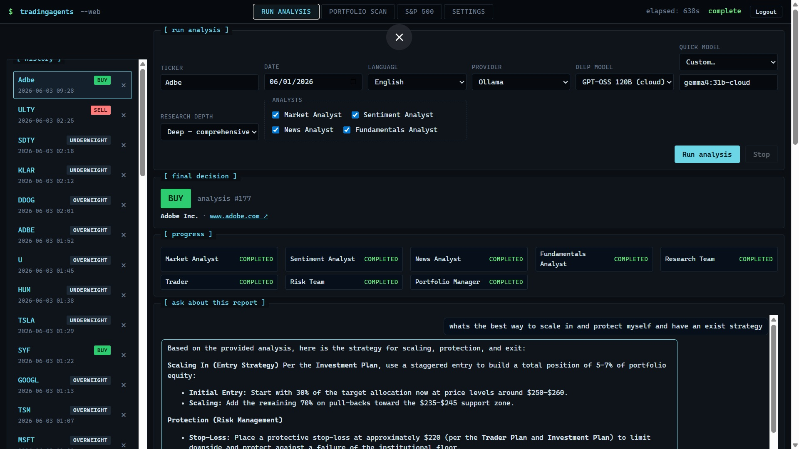
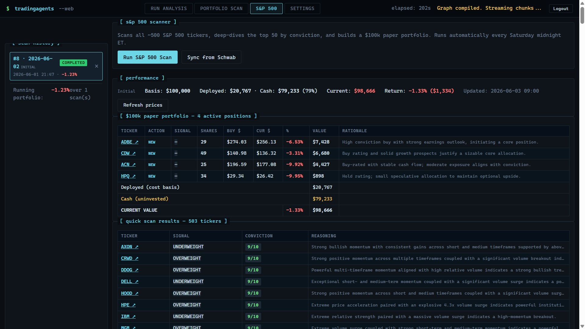

<p align="center">
  
</p>

# TradingAgents — Web Dashboard & Deployment

A self-hosted web dashboard for running multi-agent LLM trading analysis: real-time agent streaming, Schwab portfolio scanning, S&P 500 automation, and container-based deployment.

<div align="center">
  
  
  
  
  
</div>

> **For research and educational purposes only.** Trading performance varies with the chosen models, data quality, and market conditions. This is **not** financial, investment, or trading advice.

---

## Overview

TradingAgents runs a team of specialized LLM agents that mirror the desks of a real trading firm — analysts, researchers, a trader, and a risk/portfolio manager — and surfaces the whole pipeline in a real-time web dashboard. Submit a ticker and watch each agent stream its reasoning, ending in a BUY / SELL / HOLD decision with full reports; connect a Schwab account to scan a live portfolio; or let the scheduler sweep the entire S&P 500 every week and rebalance a paper portfolio on its own.

The project ships as container images and deploys as a Portainer edge stack, backed by a single FastAPI service and a SQLite database. The repository is **self-contained** — the underlying TradingAgents agent framework is vendored in directly, so everything needed to build and run the dashboard lives in this repo with no dependency on the upstream project.

---

## The Agent Team

Each agent owns a narrow slice of the decision and hands its findings to the next stage.

**Analysts** — four agents each study one angle of a ticker:
- **Fundamentals** — financial statements, valuation, and balance-sheet health
- **Sentiment** — news headlines and social chatter distilled into a single mood read
- **News** — macro events and market-moving headlines
- **Technical** — price action and indicators (MACD, RSI, Bollinger Bands)

**Researchers** — a bull and a bear argue the analysts' findings in a structured debate, weighing upside against risk.

**Trader** — synthesizes every report into a concrete call: direction, timing, and size.

**Risk Management & Portfolio Manager** — stress-tests the trade against volatility and liquidity, then the Portfolio Manager approves, trims, or rejects it before it reaches the (paper) book.

---

## Features

**🖥️ Web Dashboard**
- Terminal-aesthetic UI with dark theme and color-coded signals
- 4-tab interface: Run Analysis, Portfolio Scan, S&P 500 Scanner, Settings (Schwab connection + credentials live under Settings)
- Real-time WebSocket streaming of agent progress and reports
- Interactive technical charts with RSI, MACD, Bollinger Bands overlays
- Per-analysis Q&A thread (multi-turn conversation without re-running)
- Live **Agent Bus** feed — watch analysts, researchers, and the risk team communicate in real time as the pipeline runs

**📊 Portfolio & Market Automation**
- Schwab OAuth integration for brokerage account scanning
- Selectable data source — Schwab MCP server or built-in collection method (toggle in settings)
- Automated nightly portfolio analysis of all holdings
- S&P 500 weekly scanner (all ~500 tickers, deep-dive top 50, $100k portfolio builder)
- Background job scheduler (APScheduler with cron expressions)

**🔐 Provider & Credential Management**
- Ollama Cloud as the deployed default backend, with 14+ LLM providers supported (OpenAI, Anthropic, Google, xAI, DeepSeek, Qwen, GLM, MiniMax, OpenRouter, Azure, Ollama, Mistral, custom)
- Dashboard API key management — add/update/delete provider keys without `.env`
- Dynamic model selection with custom model name input
- Secure credential storage in SQLite (masked in UI)

**🏗️ Deployment Architecture**
- Six-container stack from three pre-built images: backends/CLI (`tradingagents`), nginx web tier (`tradingagents-web`), and the Agent Bus (`mcp-switchboard`)
- nginx serves the SPA and reverse-proxies separate `api` and `portfolio` FastAPI backends
- Dedicated scheduler container (APScheduler) for nightly portfolio scans, the weekly S&P 500 sweep, the 5am newsletter, and hourly Schwab-token health
- SQLite with WAL mode for concurrent access and persistence
- Deployed as a Portainer edge stack; images built and pushed to `ghcr.io` by GitHub Actions CI

**🔗 Companion: [schwab-mcp](https://github.com/Jemplayer82/schwab-mcp)**
- Containerized Node.js MCP server that gives TradingAgents a direct, real-time connection to your Schwab brokerage account
- Enables the dashboard to query live quotes, account positions, orders, and transaction history straight from Schwab
- Optional — a settings checkbox switches between the MCP server and the built-in data collection method

---

## Screenshots

### Run Analysis



*Submit a ticker and watch each agent — Market, Sentiment, News, Fundamentals, Research, Trader, Risk, and Portfolio Manager — stream its progress in real time, ending in a BUY/SELL/HOLD decision with full reports.*

### Q&A & Technical Chart


*Ask follow-up questions grounded in the saved analysis (e.g. "what would a good entrance point be?") and explore the interactive price chart with indicators.*

### Agent Team


*Every analyst, the Research and Risk teams, the Trader, and the Portfolio Manager complete in sequence, producing a final decision and a scaling / risk-management strategy.*

### S&P 500 Scanner



*Scans all ~500 tickers, deep-dives the top 50 by conviction, and builds a $100k paper portfolio with live performance tracking. Runs automatically every Saturday.*

---

## Quick Start

### Prerequisites

- Docker & Docker Compose
- An Ollama Cloud API key (or another supported provider's key)
- Python 3.12+ (for local CLI development)
- Portainer (optional — for edge stack deployment on a home lab / remote host)

### Docker Deployment (Recommended)

The full stack is defined in the repo's `docker-compose.yml` — **six services across three pre-built `ghcr.io` images** (built by GitHub Actions). Clone, configure, and bring it up:

```bash
git clone https://github.com/Jemplayer82/TradingAgents.git
cd TradingAgents
cp .env.example .env

# Edit .env — at minimum set:
#   OLLAMA_API_KEY=        your Ollama Cloud key (https://ollama.com)
#   TOKEN_ENCRYPTION_KEY=  python -c "import base64,os; print(base64.urlsafe_b64encode(os.urandom(32)).decode())"
#   SWITCHBOARD_MCP_TOKEN= python -c "import secrets; print(secrets.token_urlsafe(32))"

docker compose up -d
```

Open **http://localhost:8080** — the `tradingagents-web` nginx container serves the dashboard and reverse-proxies the API backends. On a Portainer host, browse to `http://<host>:8080`.

> **Portainer edge stack:** set all secrets in the stack environment (never in the committed compose file). After each fresh CI build, force-pull the `:latest` images on the host before redeploying so cached images aren't reused.

### Interactive CLI

The `tradingagents` service runs the interactive CLI from the same image as the backends, accessed via the Portainer console (or `docker attach`):

```bash
docker run -it \
  -e OLLAMA_API_KEY=your_key \
  -e OLLAMA_BASE_URL=https://ollama.com/v1 \
  ghcr.io/jemplayer82/tradingagents:latest
```

### Local Development

```bash
pip install -e .
pip install -r requirements.txt

export TRADINGAGENTS_WEB_DB=./web.db   # optional; defaults to ~/.tradingagents/web.db
export OLLAMA_API_KEY=your_key
export OLLAMA_BASE_URL=https://ollama.com/v1

# Analysis + Schwab OAuth API
uvicorn web.main:app --reload --port 8000

# Portfolio / S&P 500 scan API (separate process)
uvicorn web.portfolio_main:app --reload --port 8001

# Scheduler (nightly scan · newsletter · token health)
python -m web.scheduler
```

The nginx `tradingagents-web` tier is only needed in Docker; in local dev hit the API ports directly.

---

## Features in Detail

### Run Analysis Tab

Single-ticker deep analysis with real-time streaming:

1. **Input Form** — Ticker, date, language, LLM provider, deep/quick models, research depth, analyst selection
2. **Progress Panel** — Live status of each agent via WebSocket
3. **Reports** — Market, sentiment, news, fundamentals, research plan, trader plan, final decision
4. **Technical Chart** — Price candles + RSI + MACD with interactive overlays
5. **Q&A Thread** — Multi-turn follow-up questions without re-running the full analysis
6. **Live Reasoning** — each agent's streamed train-of-thought (tool calls included), shown beneath the reports

### Schwab Tab

Connect your Charles Schwab account via OAuth 2.0 to enable automated portfolio scanning. Tokens are stored securely and refresh automatically.

**Data source toggle.** A checkbox in settings lets you choose how account and market data is collected:

- **Schwab MCP server** *(checked)* — Routes all Schwab requests through the [schwab-mcp](https://github.com/Jemplayer82/schwab-mcp) server for live quotes, positions, orders, and transaction history.
- **Built-in method** *(unchecked)* — Uses the dashboard's own market-data retrieval (yfinance) and does not connect to Schwab at all.

When the MCP server is enabled, account positions and market data come directly from your Schwab brokerage account; the built-in method instead pulls public market data via yfinance.

### Portfolio Scan Tab

View results from automated Schwab portfolio scans:

- Aggregated portfolio briefing
- Per-ticker analysis cards with signals and rationales
- Links to full detailed analyses

### S&P 500 Tab

Weekly automated scan of all ~500 S&P 500 tickers, run in three phases:

- **Phase 1 (Quick)** — All ~500 tickers scored via yfinance + lightweight LLM
- **Phase 2 (Deep)** — Top 50 by conviction via the full multi-agent graph
- **Phase 3 (Allocate)** — Build a $100k portfolio with position sizing

The scan re-runs automatically every Saturday, and the AI agent rebalances the paper portfolio — adding, trimming, or exiting positions as it sees fit. Results include an interactive allocation table with entry prices and performance tracking.

### Credentials Tab

API keys are managed directly from the Credentials tab — no `.env` editing required. Supports all major providers. Keys are masked in the UI (last 4 characters visible).

---

## Agent Bus — Watch the Agents Talk

The **Agent Bus** mirrors every inter-agent handoff from the multi-agent pipeline onto a dedicated [mcp-switchboard](https://github.com/Jemplayer82/mcp-switchboard) instance running inside the stack, then streams the messages to a live feed panel in the dashboard. A visitor can watch the analysts deliver reports, the bull and bear researchers debate, the risk team stress-test the trade, and the portfolio manager reach a final decision — in real time, as the run happens.

The pipeline orchestrator stays in charge. The bus is a **read-only mirror** — agent-graph code is untouched; every tap lives in the `web/` layer.

### How it works

```
  Multi-Agent Pipeline             Bus Mirror                     Dashboard
  ────────────────────   ──────────────────────────────────   ──────────────────

  4 Analysts ─────────→  report deltas  → result messages   →┐
  Bull / Bear debate ─→  state changes  → chat turns         →├─ switchboard :3107
  Research Manager ───→  handoffs       → instructions       →│   analysis-{id}
  Trader ─────────────→  handoffs       → instructions       →│        │
  Risk team ──────────→  state changes  → chat turns         →│        │ /api/bus WS
  Portfolio Manager ──→  final result   → FINAL decision     →┘        ↓
                                                              [ Agent Bus ]  ●
  The graph stays the orchestrator.                           Orchestrator   instruction
  The bus is a read-only mirror of handoffs.                  Market Analyst result
                                                              Bull / Bear    chat
                                                              Portfolio Mgr  result
```

### Enabling the Agent Bus

The `switchboard` service is already defined in `docker-compose.yml`. Generate a bearer token and set one environment variable — it starts on the next `docker compose up`:

```bash
# Generate a fresh bearer token — keep this secret, like a password
python -c "import secrets; print(secrets.token_urlsafe(32))"
```

Add the output to your `.env` (or Portainer stack environment):

```bash
SWITCHBOARD_MCP_TOKEN=<your-generated-token>
```

The `switchboard` container starts automatically, `tradingagents-web` connects to it at `http://switchboard:3107`, and the **[ Agent Bus ]** panel appears live on the Run Analysis tab.

### Agent Bus Environment Variables

| Variable | Required | Default | Purpose |
|---|---|---|---|
| `SWITCHBOARD_MCP_TOKEN` | Yes | — | Bearer token for the in-stack switchboard. Generate: `python -c "import secrets; print(secrets.token_urlsafe(32))"` |
| `BUS_MIRROR` | No | `analysis` | Set to `off` to disable all bus publishing without stopping the switchboard container |
| `SWITCHBOARD_URL` | Auto | `http://switchboard:3107` | Resolved by compose — only override if running the switchboard outside the stack |

---

## Schwab MCP Companion

[**schwab-mcp**](https://github.com/Jemplayer82/schwab-mcp) is a companion containerized Node.js MCP server that gives TradingAgents a direct, real-time connection to your Schwab brokerage account. Rather than relying on manual data exports or delayed feeds, the dashboard communicates with Schwab through schwab-mcp to pull live quotes, account positions, open orders, and transaction history — enabling the Portfolio Scan, S&P 500 scanner, and OAuth token management to work seamlessly.

Using schwab-mcp is optional. A checkbox in the Schwab settings lets you switch between the MCP server and the dashboard's built-in data collection method, so you can run with or without the companion server.

### Available Tools

| Tool | Description |
|------|-------------|
| `get_quotes` | Real-time quote data for one or more symbols |
| `get_accounts` | Account balances and positions |
| `get_orders` | Open and historical orders |
| `place_order` | Submit equity orders |
| `get_transactions` | Account transaction history |
| `get_market_hours` | Market open/close status |

```bash
docker run -p 3000:3000 \
  -e SCHWAB_CLIENT_ID=your_client_id \
  -e SCHWAB_CLIENT_SECRET=your_secret \
  ghcr.io/jemplayer82/schwab-mcp:latest
```

See [Jemplayer82/schwab-mcp](https://github.com/Jemplayer82/schwab-mcp) for full setup and MCP client configuration.

---

## Architecture

### Deployment Topology

The stack runs **six containers built from three pre-built `ghcr.io` images** (GitHub Actions CI), deployed as a Portainer edge stack. The `tradingagents-web` nginx tier is the only published port; everything else talks over the internal Docker network:

```
Portainer Edge Stack  (openclaw home lab)
│
├─ tradingagents-web         ghcr.io/jemplayer82/tradingagents-web   (nginx)
│    host 8080 → container 8000  ·  static SPA + reverse proxy
│    └─ /api/* → tradingagents-api · tradingagents-portfolio
│
├─ tradingagents-api         ghcr.io/jemplayer82/tradingagents       (FastAPI · web.main:app · :8000)
│    single-ticker analysis · Schwab OAuth · chart data · Q&A · Agent Bus
│    └─ depends_on switchboard
│
├─ tradingagents-portfolio   ghcr.io/jemplayer82/tradingagents       (FastAPI · web.portfolio_main:app · :8000)
│    portfolio + S&P 500 scans  (isolated so long scans don't block ad-hoc analysis)
│    └─ depends_on tradingagents-api
│
├─ tradingagents-scheduler   ghcr.io/jemplayer82/tradingagents       (APScheduler · web.scheduler)
│    nightly portfolio scan · 5am newsletter · hourly Schwab-token health
│    └─ depends_on tradingagents-portfolio
│
├─ switchboard               ghcr.io/jemplayer82/mcp-switchboard                  (Agent Bus · :3107 internal)
│    read-only mirror of inter-agent handoffs → streamed to the dashboard via /api/bus
│
└─ tradingagents             ghcr.io/jemplayer82/tradingagents       (interactive CLI · console attach)

Volumes:      tradingagents_data (SQLite · cache · tokens) · switchboard_data (bus DB)
LLM backend:  Ollama Cloud  (https://ollama.com/v1, OLLAMA_API_KEY)
Images built by GitHub Actions → pushed to ghcr.io
```

The four FastAPI/CLI roles (`api`, `portfolio`, `scheduler`, `cli`) share **one image** (`tradingagents`) with different entrypoints; nginx (`tradingagents-web`) and the bus (`mcp-switchboard`) are the other two images. Secrets live in the Portainer stack environment and are never committed.

### Data Models

| Model | Purpose |
|-------|---------|
| **Preferences** | User settings (LLM provider, models, language, analysts, research depth) |
| **Analyses** | Single-ticker runs with reports and signals (BUY/SELL/HOLD) |
| **Portfolio Scans** | Batch analysis of Schwab holdings |
| **S&P 500 Scans** | Multi-phase SPX analysis with portfolio allocations |
| **Provider Credentials** | API keys (encrypted, masked in UI) |

---

## Configuration

### Environment Variables

```bash
# Database (auto-creates on the tradingagents_data volume)
TRADINGAGENTS_WEB_DB=/home/appuser/.tradingagents/web.db   # optional; this is the default

# LLM backend — Ollama Cloud (deployed default)
OLLAMA_API_KEY=your_key                 # stack env only — never commit
OLLAMA_BASE_URL=https://ollama.com/v1

# Schwab OAuth (tradingagents-api + tradingagents-portfolio)
SCHWAB_APP_KEY=your_app_key
SCHWAB_APP_SECRET=your_app_secret
SCHWAB_CALLBACK_URL=https://your-host/api/auth/schwab/callback
TOKEN_ENCRYPTION_KEY=<base64-32-bytes>  # encrypts stored Schwab tokens
                                        # generate: python -c "import base64,os; print(base64.urlsafe_b64encode(os.urandom(32)).decode())"

# Agent Bus (switchboard container)
SWITCHBOARD_MCP_TOKEN=<generated>       # bearer token — python -c "import secrets; print(secrets.token_urlsafe(32))"
BUS_MIRROR=analysis                     # set to "off" to disable bus publishing without stopping the container
# SWITCHBOARD_URL is resolved by compose → http://switchboard:3107

# Scheduler — nightly newsletter + alerts (tradingagents-scheduler)
SCHEDULER_TIMEZONE=America/New_York
DASHBOARD_URL=https://your-dashboard-host
SMTP_HOST=smtp.example.com
SMTP_PORT=587
SMTP_USER=...
SMTP_PASS=...
NEWSLETTER_FROM=...
NEWSLETTER_TO=...
```

> **Security:** every secret above must be injected via the Portainer stack environment (or a local `.env` that is git-ignored) — never committed to the public repo.

---

## Technical Stack

| Layer | Technology |
|-------|------------|
| Web Tier | nginx — serves the SPA and reverse-proxies the API backends |
| Backend | FastAPI + Uvicorn (separate `api` and `portfolio` services) |
| Frontend | Vanilla JS + HTML5 (no build step) |
| Database | SQLite with WAL mode |
| Charting | lightweight-charts |
| Task Scheduling | APScheduler (dedicated `scheduler` container) |
| Markdown Rendering | marked.js |
| Agent Bus | mcp-switchboard (streamable-HTTP MCP) |
| Containers | Docker — 6-service stack via Portainer edge stack |
| CI/CD | GitHub Actions matrix → `ghcr.io` images |
| LLM Backend | Ollama Cloud (default), LangChain multi-provider abstraction |
| Stock Data | yfinance + 5-year caching |
| Technical Indicators | stockstats |
| Schwab Integration | OAuth 2.0 + [schwab-mcp](https://github.com/Jemplayer82/schwab-mcp) |

---

## Project Structure

```
tradingagents/
├── tradingagents/
│   ├── graph/              # Core multi-agent graph
│   ├── dataflows/          # Data fetching & indicators
│   └── tools/              # LLM tool definitions
├── web/
│   ├── main.py             # tradingagents-api — analysis + Schwab OAuth + Agent Bus
│   ├── portfolio_main.py   # tradingagents-portfolio — portfolio + S&P 500 scan API
│   ├── scheduler.py        # tradingagents-scheduler — nightly scan · newsletter · token health
│   ├── db.py               # SQLite schema
│   ├── credentials.py      # API key management
│   ├── llm_helpers.py      # Multi-provider LLM abstraction
│   ├── spy_scanner.py      # S&P 500 3-phase scanner
│   ├── spy_allocator.py    # $100k portfolio builder
│   ├── bus.py              # Switchboard MCP client + resilient publisher
│   ├── bus_mirror.py       # Mirror agent handoffs onto the Agent Bus
│   └── static/             # SPA files (served by nginx)
│       ├── index.html
│       ├── app.js
│       ├── bus.js          # Agent Bus WebSocket client + live feed panel
│       ├── portfolio.js
│       ├── spy.js
│       ├── credentials.js
│       └── styles.css
├── Dockerfile              # backends + CLI → ghcr.io/jemplayer82/tradingagents
├── Dockerfile.web          # nginx tier   → ghcr.io/jemplayer82/tradingagents-web
└── docker-compose.yml      # 6-service stack
```

### Running Tests

```bash
pytest tests/ -v
```

---

## Troubleshooting

### Chart endpoint returns 500 error

**Cause:** Legacy cached OHLCV CSV files have an `index` column instead of `Date`.

**Fix:** Code normalizes column names automatically. If it persists, clear the cache:

```bash
rm -rf ~/.tradingagents/cache/*.csv
```

### Schwab scan doesn't start

**Cause:** OAuth token not saved or expired.

**Fix:** Click "Connect to Schwab" in the Schwab tab, complete the OAuth flow, and check token status.

### S&P 500 scan hangs

**Cause:** Network slowness, LLM provider overload, or database lock.

**Fix:** Check the portfolio backend logs, retry, and verify the Ollama Cloud key:

```bash
docker logs tradingagents-portfolio
```

### API key not taking effect

**Cause:** Process running with stale config.

**Fix:** Restart the analysis backend (and the scheduler if a scheduled job uses it):

```bash
docker restart tradingagents-api
```

### Agent Bus panel stays empty

**Cause:** `SWITCHBOARD_MCP_TOKEN` not set, or the `switchboard` container didn't start.

**Fix:** Confirm the token is in the stack env and the container is healthy:

```bash
docker logs switchboard
```

### Stale image after a fresh CI build

**Cause:** The host reused a cached `:latest` image.

**Fix:** Force-pull all images before redeploying the stack:

```bash
docker compose pull && docker compose up -d
```

### Port 8080 already in use

**Fix:** Change the host side of the `tradingagents-web` port mapping in `docker-compose.yml`:

```yaml
ports:
  - "9090:8000"   # change 9090 to any free host port
```

---

## Contributing

Pull requests welcome! Areas of focus:

- UI/UX improvements (mobile responsiveness, keyboard shortcuts)
- New LLM providers
- Chart enhancements (more indicators, drawing tools)
- Performance optimizations
- Testing (unit, integration, E2E)
- Documentation

---

## License & Credits

This project builds on the open-source [TradingAgents](https://github.com/TauricResearch/TradingAgents) multi-agent framework. The repository is **self-contained** — the framework is vendored in and extended here with a full web dashboard, Schwab integration, and container-based deployment, so it builds and runs independently. See the repository for license details.

Powered by FastAPI, LangChain, yfinance, stockstats, lightweight-charts, APScheduler, and many other open-source libraries.

---

**Last Updated:** June 13, 2026
**Repo:** https://github.com/Jemplayer82/TradingAgents
