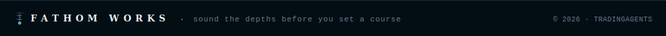

<p align="center">
  
</p>

# `$ tradingagents-web`

**A self-hosted multi-agent LLM trading dashboard** — real-time agent streaming, Schwab portfolio scanning, S&P 500 automation, and container-based deployment.

*A [Fathom Works](https://github.com/jemplayer82) project.*

<div align="center">
  
  
  
  
  
  
</div>

> [!WARNING]
> For research and educational purposes only. Trading performance varies with the chosen models, data quality, and market conditions. This is not financial, investment, or trading advice.

---

## `[ overview ]`

TradingAgents runs a team of specialized LLM agents that mirror the desks of a real trading firm — analysts, researchers, a trader, and a risk/portfolio manager — and surfaces the whole pipeline in a real-time web dashboard. Submit a ticker and watch each agent stream its reasoning, ending in a BUY / SELL / HOLD decision with full reports; connect a Schwab account to scan a live portfolio; or let the scheduler sweep the entire S&P 500 every week and rebalance a paper portfolio on its own.

The project ships as container images and deploys as a Portainer edge stack, backed by a single FastAPI service and a SQLite database. The repository is **self-contained** — the underlying TradingAgents agent framework is vendored in directly, so everything needed to build and run the dashboard lives in this repo with no dependency on the upstream project.

---

## `[ agent team ]`

Each agent owns a narrow slice of the decision and hands its findings to the next stage.

**Analysts** — four agents each study one angle of a ticker:
- **Fundamentals** — financial statements, valuation, and balance-sheet health
- **Sentiment** — news headlines and social chatter distilled into a single mood read
- **News** — macro events and market-moving headlines
- **Technical** — price action and indicators (MACD, RSI, Bollinger Bands)

**Researchers** — a bull and a bear argue the analysts' findings in a structured debate, weighing upside against risk.

**Trader** — synthesizes every report into a concrete call: direction, timing, and size.

**Risk Management & Portfolio Manager** — stress-tests the trade against volatility and liquidity, then the Portfolio Manager approves, trims, or rejects it before it reaches the (paper) book.

---

## `[ features ]`

**Web Dashboard**
- Terminal-aesthetic UI with dark theme and color-coded signals
- 4-tab interface: Run Analysis, Portfolio Scan, S&P 500 Scanner, Settings (Schwab connection + credentials live under Settings)
- Real-time WebSocket streaming of agent progress and reports
- Interactive technical charts with RSI, MACD, Bollinger Bands overlays
- Per-analysis Q&A thread (multi-turn conversation without re-running)
- Live **Agent Bus** feed — watch analysts, researchers, and the risk team communicate in real time as the pipeline runs

**Portfolio & Market Automation**
- Schwab OAuth integration for brokerage account scanning
- Selectable data source — Schwab MCP server or built-in collection method (toggle in settings)
- Automated nightly portfolio analysis of all holdings
- S&P 500 weekly scanner (all ~500 tickers, deep-dive top 50, $100k portfolio builder)
- Background job scheduler (APScheduler with cron expressions)

**Provider & Credential Management**
- Ollama Cloud as the deployed default backend, with 14+ LLM providers supported (OpenAI, Anthropic, Google, xAI, DeepSeek, Qwen, GLM, MiniMax, OpenRouter, Azure, Ollama, Mistral, custom)
- Dashboard API key management — add/update/delete provider keys without `.env`
- Dynamic model selection with custom model name input
- Secure credential storage in SQLite (masked in UI)

**Deployment Architecture**
- Six-container stack from three pre-built images: backends/CLI (`tradingagents`), nginx web tier (`tradingagents-web`), and the Agent Bus (`mcp-switchboard`)
- nginx serves the SPA and reverse-proxies separate `api` and `portfolio` FastAPI backends
- Dedicated scheduler container (APScheduler) for nightly portfolio scans, the weekly S&P 500 sweep, the 5am newsletter, and hourly Schwab-token health
- SQLite with WAL mode for concurrent access and persistence
- Deployed as a Portainer edge stack; images built and pushed to `ghcr.io` by GitHub Actions CI

**Companion: [schwab-mcp](https://github.com/Jemplayer82/schwab-mcp)**
- Containerized Node.js MCP server that gives TradingAgents a direct, real-time connection to your Schwab brokerage account
- Enables the dashboard to query live quotes, account positions, orders, and transaction history straight from Schwab
- Optional — a settings checkbox switches between the MCP server and the built-in data collection method

---

## `[ screenshots ]`

### Run Analysis


*Submit a ticker and watch each agent — Market, Sentiment, News, Fundamentals, Research, Trader, Risk, and Portfolio Manager — stream its progress in real time, ending in a BUY/SELL/HOLD decision with full reports.*

### Q&A & Technical Chart


*Ask follow-up questions grounded in the saved analysis (e.g. "what would a good entrance point be?") and explore the interactive price chart with indicators.*

### Agent Team


*Every analyst, the Research and Risk teams, the Trader, and the Portfolio Manager complete in sequence, producing a final decision and a scaling / risk-management strategy.*

### S&P 500 Scanner


*Scans all ~500 tickers, deep-dives the top 50 by conviction, and builds a $100k paper portfolio with live performance tracking. Runs automatically every Saturday.*

---

## `[ quick start ]`

### Prerequisites

- Docker & Docker Compose
- An Ollama Cloud API key (or another supported provider's key)
- Python 3.12+ (for local CLI development)
- Portainer (optional — for edge stack deployment on a home lab / remote host)

### Docker Deployment

The full stack is defined in the repo's `docker-compose.yml` — six services across three pre-built `ghcr.io` images built by GitHub Actions. Clone, configure, and bring it up:

```bash
$ git clone https://github.com/Jemplayer82/TradingAgents.git
$ cd TradingAgents
$ cp .env.example .env

# Edit .env — at minimum set:
#   OLLAMA_API_KEY=        your Ollama Cloud key (https://ollama.com)
#   TOKEN_ENCRYPTION_KEY=  python -c "import base64,os; print(base64.urlsafe_b64encode(os.urandom(32)).decode())"
#   SWITCHBOARD_MCP_TOKEN= python -c "import secrets; print(secrets.token_urlsafe(32))"

$ docker compose up -d
```

Open `http://localhost:8080`. The `tradingagents-web` nginx container serves the dashboard and reverse-proxies the API backends. On a Portainer host, browse to `http://<host>:8080`.

> [!TIP]
> **Portainer edge stack:** set all secrets in the stack environment — never in the committed compose file. After each fresh CI build, force-pull `:latest` on the host before redeploying so cached images aren't reused.

### Interactive CLI

The `tradingagents` service runs the interactive CLI from the same image as the backends, accessed via the Portainer console or `docker attach`:

```bash
$ docker run -it \
    -e OLLAMA_API_KEY=your_key \
    -e OLLAMA_BASE_URL=https://ollama.com/v1 \
    ghcr.io/jemplayer82/tradingagents:latest
```

### Local Development

```bash
$ pip install -e .
$ pip install -r requirements.txt

$ export TRADINGAGENTS_WEB_DB=./web.db
$ export OLLAMA_API_KEY=your_key
$ export OLLAMA_BASE_URL=https://ollama.com/v1

# Analysis + Schwab OAuth API
$ uvicorn web.main:app --reload --port 8000

# Portfolio / S&P 500 scan API (separate process)
$ uvicorn web.portfolio_main:app --reload --port 8001

# Scheduler (nightly scan · newsletter · token health)
$ python -m web.scheduler
```

The nginx `tradingagents-web` tier is only needed in Docker; in local dev hit the API ports directly.

---

## `[ features in detail ]`

### Run Analysis Tab

Single-ticker deep analysis with real-time streaming:

1. **Input Form** — Ticker, date, language, LLM provider, deep/quick models, research depth, **aggressiveness**, **decision bias**, analyst selection
2. **Progress Panel** — Live status of each agent via WebSocket
3. **Reports** — Market, sentiment, news, fundamentals, research plan, trader plan, final decision
4. **Technical Chart** — Price candles + RSI + MACD with interactive overlays
5. **Q&A Thread** — Multi-turn follow-up questions without re-running the full analysis
6. **Live Reasoning** — each agent's streamed train-of-thought (tool calls included), shown beneath the reports

> **Aggressiveness vs. bias.** *Aggressiveness* (1–10) controls how much risk the run takes — it sets debate depth (1–3 → 1 round, 4–7 → 2, 8–10 → 3) and, in the portfolio builders, position sizing (≤3: max 7% per position / 20% cash · 4–7: 12% / 10% · 8–10: 20% / 5%). *Decision bias* (bullish / neutral / bearish) nudges the stance the agents lean toward on borderline calls — a suggestion, not a hard limit. The two are **independent**: aggressiveness = *how much*, bias = *which way*. Both are available on the Run Analysis, Portfolio Scan, and S&P 500 (per paper-account) tabs.

### Schwab Tab

Connect your Charles Schwab account via OAuth 2.0 to enable automated portfolio scanning. Tokens are stored securely and refresh automatically.

**Data source toggle.** A checkbox in settings lets you choose how account and market data is collected:

- **Schwab MCP server** *(checked)* — Routes all Schwab requests through the [schwab-mcp](https://github.com/Jemplayer82/schwab-mcp) server for live quotes, positions, orders, and transaction history.
- **Built-in method** *(unchecked)* — Uses the dashboard's own market-data retrieval (yfinance) and does not connect to Schwab at all.

When the MCP server is enabled, account positions and market data come directly from your Schwab brokerage account; the built-in method instead pulls public market data via yfinance.

### Portfolio Scan Tab

Run and review scans of your real Schwab holdings:

- **Run Scan Now** — kick off an on-demand scan with its own **aggressiveness** + **decision bias** (the nightly cron at 22:00 ET runs with defaults)
- Aggregated portfolio briefing
- Per-ticker analysis cards with signals and rationales
- Links to full detailed analyses

### S&P 500 Tab

Weekly automated scan of all ~500 S&P 500 tickers, run in three phases:

- **Phase 1 (Quick)** — All ~500 tickers scored via yfinance + lightweight LLM
- **Phase 2 (Deep)** — Top 50 by conviction via the full multi-agent graph
- **Phase 3 (Allocate)** — Build a $100k portfolio with position sizing

The scan re-runs automatically every Saturday, and the AI agent rebalances the paper portfolio — adding, trimming, or exiting positions as it sees fit. Results include an interactive allocation table with entry prices and performance tracking.

### Credentials Tab

Two distinct things live here — they are **not** duplicates:

- **LLM provider API keys** (OpenAI, Anthropic, Google, xAI, …) — your model-provider secrets, masked in the UI (last 4 visible).
- **Settings groups** (Ollama & Bus Routing, Market Data, Brokerage, Email, …) — non-key configuration. *Ollama & Bus Routing* holds the Ollama base URL + key (Ollama has no entry in the provider-keys list, so this is its only home) and the switchboard routing hints — **not** provider keys.

No `.env` editing required; saved values apply immediately and override the `.env`/compose fallback.

---

## `[ agent bus ]`

The **Agent Bus** mirrors every inter-agent handoff from the multi-agent pipeline onto a dedicated [mcp-switchboard](https://github.com/Jemplayer82/mcp-switchboard) instance running inside the stack, then streams the messages to a live feed panel in the dashboard. A visitor can watch the analysts deliver reports, the bull and bear researchers debate, the risk team stress-test the trade, and the portfolio manager reach a final decision — in real time, as the run happens.

The pipeline orchestrator stays in charge. The bus is a **read-only mirror** — agent-graph code is untouched; every tap lives in the `web/` layer.

### How it works

```
  Multi-Agent Pipeline             Bus Mirror                     Dashboard
  ────────────────────   ──────────────────────────────────   ──────────────────

  4 Analysts ─────────→  report deltas  → result messages   →┐
  Bull / Bear debate ─→  state changes  → chat turns         →├─ switchboard :3107
  Research Manager ───→  handoffs       → instructions       →│   analysis-{id}
  Trader ─────────────→  handoffs       → instructions       →│        │
  Risk team ──────────→  state changes  → chat turns         →│        │ /api/bus WS
  Portfolio Manager ──→  final result   → FINAL decision     →┘        ↓
                                                              [ Agent Bus ]  ●
  The graph stays the orchestrator.                           Orchestrator   instruction
  The bus is a read-only mirror of handoffs.                  Market Analyst result
                                                              Bull / Bear    chat
                                                              Portfolio Mgr  result
```

### Enabling the Agent Bus

The `switchboard` service is already defined in `docker-compose.yml`. Generate a bearer token and set one environment variable — it starts on the next `docker compose up`:

```bash
$ python -c "import secrets; print(secrets.token_urlsafe(32))"
```

Add the output to your `.env` (or Portainer stack environment):

```bash
SWITCHBOARD_MCP_TOKEN=<your-generated-token>
```

The `switchboard` container starts automatically, `tradingagents-web` connects to it at `http://switchboard:3107`, and the **[ Agent Bus ]** panel appears live on the Run Analysis tab.

### Agent Bus Environment Variables

| Variable | Required | Default | Purpose |
|---|---|---|---|
| `SWITCHBOARD_MCP_TOKEN` | Yes | — | Bearer token for the in-stack switchboard. Generate: `python -c "import secrets; print(secrets.token_urlsafe(32))"` |
| `BUS_MIRROR` | No | `analysis` | Set to `off` to disable all bus publishing without stopping the switchboard container |
| `SWITCHBOARD_URL` | Auto | `http://switchboard:3107` | Resolved by compose — only override if running the switchboard outside the stack |
| `SWITCHBOARD_TARGET_AGENT` | No | `llm-router` | Bus agent that answers LLM requests when `LLM_PROVIDER=switchboard` — the built-in router, or an external Claude CLI's id |
| `SWITCHBOARD_PROVIDER` | No | `ollama` | Which backend `llm-router` dispatches to (`ollama`, `openai`, `xai`, `grok`, `deepseek`, `claude`) |

The bus is also published on **host port `3109`** (`docker-compose.yml`) so off-stack agents can connect at `http://<host>:3109/mcp`.

### Connecting Claude (streaming daemon)

With `LLM_PROVIDER=switchboard`, every LLM call goes as an `llm_request` DM on the bus to whatever agent is registered under `SWITCHBOARD_TARGET_AGENT`:

- **`llm-router`** (default) — built-in service, dispatches to Ollama / OpenAI-compatible backends.
- **`cleo`** — the included `scripts/cleo_llm_handler.py` daemon; drives your **local `claude` CLI in headless streaming mode** and **streams tokens live** to the dashboard as Claude generates them. Uses your Claude Code subscription session — **no Anthropic API key, no per-token billing.**

> ⚠️ The `SWITCHBOARD_MCP_TOKEN` bearer is the **only** gate on the `3109` host port. Keep it strong; don't expose it to the public internet without TLS in front.

#### Quick setup

> **Prerequisite:** run this on a machine where `claude -p "hi"` already works — i.e. Claude Code is installed and logged in (`claude` on PATH, or set `CLAUDE_BIN`). The daemon reaches the switchboard over HTTP, so it can run anywhere that can hit `SWITCHBOARD_URL`.

```bash
# 1. Install deps (httpx is usually already present)
pip install httpx

# 2. Run the daemon — shells out to `claude -p`, using your Claude Code session (free, no API key)
SWITCHBOARD_URL=http://<host>:3109      \
SWITCHBOARD_MCP_TOKEN=<your-token>      \
python scripts/cleo_llm_handler.py
```

```
# 3. In the dashboard → Settings → Ollama & Bus Routing:
#    Switchboard — LLM handler agent:   cleo
#    Switchboard — backend provider:    claude

# 4. In the Analysis form, pick provider "Switchboard (Bus LLM)" and a Claude model
#    (e.g. claude-sonnet-4-6 or claude-opus-4-8) then run as normal.
```

The daemon handles concurrent requests (8 workers), so parallel analyst calls during S&P 500 scans don't block each other. Each call uses a unique reply inbox so responses never cross wires.

#### Streaming protocol

When `stream: true` is in the `llm_request` payload (the default), the handler sends one `llm_stream_chunk` DM per text delta:

```json
{ "type": "llm_stream_chunk", "content": "{\"delta\": \"some text\", \"done\": false}" }
```

A final chunk signals completion and carries any tool calls:

```json
{ "type": "llm_stream_chunk", "content": "{\"delta\": \"\", \"done\": true, \"tool_calls\": []}" }
```

The dashboard handles these automatically — tokens appear in each agent's report tab as they arrive.

---

## `[ schwab mcp ]`

[**schwab-mcp**](https://github.com/Jemplayer82/schwab-mcp) is a companion containerized Node.js MCP server that gives TradingAgents a direct, real-time connection to your Schwab brokerage account. Rather than relying on manual data exports or delayed feeds, the dashboard communicates with Schwab through schwab-mcp to pull live quotes, account positions, open orders, and transaction history — enabling the Portfolio Scan, S&P 500 scanner, and OAuth token management to work seamlessly.

Using schwab-mcp is optional. A checkbox in the Schwab settings lets you switch between the MCP server and the dashboard's built-in data collection method.

| Tool | Description |
|------|-------------|
| `get_quotes` | Real-time quote data for one or more symbols |
| `get_accounts` | Account balances and positions |
| `get_orders` | Open and historical orders |
| `place_order` | Submit equity orders |
| `get_transactions` | Account transaction history |
| `get_market_hours` | Market open/close status |

```bash
$ docker run -p 3000:3000 \
    -e SCHWAB_CLIENT_ID=your_client_id \
    -e SCHWAB_CLIENT_SECRET=your_secret \
    ghcr.io/jemplayer82/schwab-mcp:latest
```

See [Jemplayer82/schwab-mcp](https://github.com/Jemplayer82/schwab-mcp) for full setup and MCP client configuration.

---

## `[ data sources & brokerages ]`

Where market, indicator, and account data come from:

| Source | Used for | Status |
|---|---|---|
| **yfinance** | Default price/OHLCV + locally-computed technical indicators (via `stockstats`); S&P 500 quick scan | ✅ Built-in, free, no key |
| **Schwab MCP** | Live holdings/positions + OHLCV quotes (feeds the local indicator calc when **Use Schwab for market data** is on) | ✅ Wired — OAuth + [schwab-mcp](https://github.com/Jemplayer82/schwab-mcp) |
| **Alpha Vantage** | *Optional* pre-calculated technical indicators (SMA/EMA/MACD/RSI/Bollinger/ATR) | ✅ Optional — set **Technical indicators source** to `alpha_vantage` + add `ALPHA_VANTAGE_API_KEY` |
| **Alpaca** | — | ⚠️ **Not implemented.** Credential fields exist in Settings (Brokerage → Alpaca), but there is **no** Alpaca holdings/quote/trade integration in the codebase yet — saving keys does nothing functional. Schwab is the only wired brokerage. |

**Technical indicators source** (Settings → Market Data) picks the indicator vendor:

- `yfinance` *(default)* — indicators computed locally with `stockstats`. The underlying OHLCV is yfinance, **or Schwab** when *Use Schwab for market data* is on. No key needed.
- `alpha_vantage` — indicators come pre-calculated from Alpha Vantage (requires `ALPHA_VANTAGE_API_KEY`).

> Schwab is an **OHLCV source**, not a pre-calculated-indicator source — it feeds the local `stockstats` calculation rather than returning ready-made indicators.

---

## `[ architecture ]`

### Deployment Topology

Six containers built from three pre-built `ghcr.io` images, deployed as a Portainer edge stack. The `tradingagents-web` nginx tier is the only published port; everything else talks over the internal Docker network:

```
Portainer Edge Stack
│
├─ tradingagents-web         ghcr.io/jemplayer82/tradingagents-web   (nginx)
│    host 8080 → container 8000  ·  static SPA + reverse proxy
│    └─ /api/* → tradingagents-api · tradingagents-portfolio
│
├─ tradingagents-api         ghcr.io/jemplayer82/tradingagents       (FastAPI · web.main:app · :8000)
│    single-ticker analysis · Schwab OAuth · chart data · Q&A · Agent Bus
│    └─ depends_on switchboard
│
├─ tradingagents-portfolio   ghcr.io/jemplayer82/tradingagents       (FastAPI · web.portfolio_main:app · :8000)
│    portfolio + S&P 500 scans  (isolated so long scans don't block ad-hoc analysis)
│    └─ depends_on tradingagents-api
│
├─ tradingagents-scheduler   ghcr.io/jemplayer82/tradingagents       (APScheduler · web.scheduler)
│    nightly portfolio scan · 5am newsletter · hourly Schwab-token health
│    └─ depends_on tradingagents-portfolio
│
├─ switchboard               ghcr.io/jemplayer82/mcp-switchboard     (Agent Bus · :3107 internal)
│    read-only mirror of inter-agent handoffs → streamed to the dashboard via /api/bus
│
└─ tradingagents             ghcr.io/jemplayer82/tradingagents       (interactive CLI · console attach)

Volumes:      tradingagents_data (SQLite · cache · tokens) · switchboard_data (bus DB)
LLM backend:  Ollama Cloud  (https://ollama.com/v1, OLLAMA_API_KEY)
Images built by GitHub Actions → pushed to ghcr.io
```

The four FastAPI/CLI roles (`api`, `portfolio`, `scheduler`, `cli`) share **one image** (`tradingagents`) with different entrypoints; nginx (`tradingagents-web`) and the bus (`mcp-switchboard`) are the other two images. Secrets live in the Portainer stack environment and are never committed.

### Data Models

| Model | Purpose |
|-------|---------|
| **Preferences** | User settings (LLM provider, models, language, analysts, research depth) |
| **Analyses** | Single-ticker runs with reports and signals (BUY/SELL/HOLD) |
| **Portfolio Scans** | Batch analysis of Schwab holdings |
| **S&P 500 Scans** | Multi-phase SPX analysis with portfolio allocations |
| **Provider Credentials** | API keys (encrypted, masked in UI) |

---

## `[ configuration ]`

```bash
# Database (auto-creates on the tradingagents_data volume)
TRADINGAGENTS_WEB_DB=/home/appuser/.tradingagents/web.db

# LLM backend — Ollama Cloud (deployed default)
OLLAMA_API_KEY=your_key
OLLAMA_BASE_URL=https://ollama.com/v1

# Schwab OAuth (tradingagents-api + tradingagents-portfolio)
SCHWAB_APP_KEY=your_app_key
SCHWAB_APP_SECRET=your_app_secret
SCHWAB_CALLBACK_URL=https://your-host/api/auth/schwab/callback
TOKEN_ENCRYPTION_KEY=<base64-32-bytes>

# Agent Bus (switchboard container)
SWITCHBOARD_MCP_TOKEN=<generated>
BUS_MIRROR=analysis

# Scheduler — nightly newsletter + alerts (tradingagents-scheduler)
SCHEDULER_TIMEZONE=America/New_York
DASHBOARD_URL=https://your-dashboard-host
SMTP_HOST=smtp.example.com
SMTP_PORT=587
SMTP_USER=...
SMTP_PASS=...
NEWSLETTER_FROM=...
NEWSLETTER_TO=...
```

> [!IMPORTANT]
> Every secret above must be injected via the Portainer stack environment or a local `.env` that is git-ignored — never committed to the repo.

---

## `[ technical stack ]`

| Layer | Technology |
|-------|------------|
| Web Tier | nginx — serves the SPA and reverse-proxies the API backends |
| Backend | FastAPI + Uvicorn (separate `api` and `portfolio` services) |
| Frontend | Vanilla JS + HTML5 (no build step) |
| Database | SQLite with WAL mode |
| Charting | lightweight-charts |
| Task Scheduling | APScheduler (dedicated `scheduler` container) |
| Markdown Rendering | marked.js |
| Agent Bus | mcp-switchboard (streamable-HTTP MCP) |
| Containers | Docker — 6-service stack via Portainer edge stack |
| CI/CD | GitHub Actions matrix → `ghcr.io` images |
| LLM Backend | Ollama Cloud (default), LangChain multi-provider abstraction |
| Stock Data | yfinance + 5-year caching |
| Technical Indicators | stockstats |
| Schwab Integration | OAuth 2.0 + [schwab-mcp](https://github.com/Jemplayer82/schwab-mcp) |

---

## `[ project structure ]`

```
tradingagents/
├── tradingagents/
│   ├── graph/              # Core multi-agent graph
│   ├── dataflows/          # Data fetching & indicators
│   └── tools/              # LLM tool definitions
├── web/
│   ├── main.py             # tradingagents-api — analysis + Schwab OAuth + Agent Bus
│   ├── portfolio_main.py   # tradingagents-portfolio — portfolio + S&P 500 scan API
│   ├── scheduler.py        # tradingagents-scheduler — nightly scan · newsletter · token health
│   ├── db.py               # SQLite schema
│   ├── credentials.py      # API key management
│   ├── llm_helpers.py      # Multi-provider LLM abstraction
│   ├── spy_scanner.py      # S&P 500 3-phase scanner
│   ├── spy_allocator.py    # $100k portfolio builder
│   ├── bus.py              # Switchboard MCP client + resilient publisher
│   ├── bus_mirror.py       # Mirror agent handoffs onto the Agent Bus
│   └── static/             # SPA files (served by nginx)
│       ├── index.html
│       ├── app.js
│       ├── bus.js          # Agent Bus WebSocket client + live feed panel
│       ├── portfolio.js
│       ├── spy.js
│       ├── credentials.js
│       └── styles.css
├── Dockerfile              # backends + CLI → ghcr.io/jemplayer82/tradingagents
├── Dockerfile.web          # nginx tier   → ghcr.io/jemplayer82/tradingagents-web
└── docker-compose.yml      # 6-service stack
```

```bash
$ pytest tests/ -v
```

---

## `[ troubleshooting ]`

### Chart endpoint returns 500 error

Legacy cached OHLCV CSV files have an `index` column instead of `Date`. Code normalizes this automatically. If it persists, clear the cache:

```bash
$ rm -rf ~/.tradingagents/cache/*.csv
```

### Schwab scan doesn't start

OAuth token not saved or expired. Click "Connect to Schwab" in the Schwab tab and complete the OAuth flow.

### S&P 500 scan hangs

Check the portfolio backend logs and verify the Ollama Cloud key:

```bash
$ docker logs tradingagents-portfolio
```

### API key not taking effect

Restart the analysis backend:

```bash
$ docker restart tradingagents-api
```

### Agent Bus panel stays empty

`SWITCHBOARD_MCP_TOKEN` not set or the `switchboard` container didn't start:

```bash
$ docker logs switchboard
```

### Stale image after a fresh CI build

```bash
$ docker compose pull && docker compose up -d
```

### Port 8080 already in use

Change the host side of the `tradingagents-web` port mapping in `docker-compose.yml`:

```yaml
ports:
  - "9090:8000"
```

---

## 🤝 Contributing

Pull requests welcome. See [CONTRIBUTING.md](./CONTRIBUTING.md) for the CLA, PR guidelines, and code style requirements (`ruff` + `pytest` must pass).

Areas of focus: UI/UX improvements, new LLM providers, chart enhancements, performance optimizations, testing, documentation.

---

## ⚖️ License

Licensed under the [GNU Affero General Public License v3.0](./LICENSE) (AGPL-3.0) — © 2026 Fathom Works.

Commercial licensing available. For inquiries: [github.com/jemplayer82](https://github.com/jemplayer82)

## 🙏 Credits

This project builds on the open-source [TradingAgents](https://github.com/TauricResearch/TradingAgents) multi-agent framework, vendored and extended here with a full web dashboard, Schwab integration, and container-based deployment.

© 2026 Fathom Works. Commercial licensing available — [github.com/jemplayer82](https://github.com/jemplayer82)

---

#### `[ credits ]`

This project builds on the open-source [TradingAgents](https://github.com/TauricResearch/TradingAgents) multi-agent framework, vendored and extended here with a full web dashboard, Schwab integration, and container-based deployment.

Powered by FastAPI, LangChain, yfinance, stockstats, lightweight-charts, APScheduler, and many other open-source libraries.


